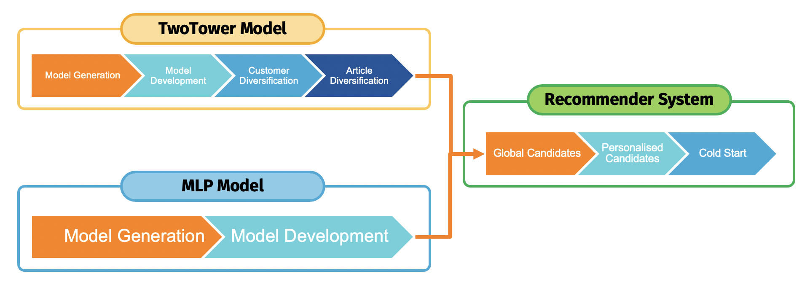

# About the project
In this research report, the efficacy of Deep Neural Networks (DNNs) for retail store recommender systems is explored. The study investigates the comparative performance of DNN-based Matrix Factorisation against MultiLayer Perceptron (MLP) models. Additionally, it evaluates the impact of feature engineering on the TwoTower model and examines the potential of personalized models in enhancing recommender system performance. Findings reveal insights into model performance, the importance of feature augmentation, and the potential for personalized models in retail recommender systems.

# Overview of the Project
The project was structured into three distinct phases. The initial phase involved a broad analysis of the data. The subsequent phase focused on intricate feature engineering research. Finally, the most extensive phase centered specifically on detailed research efforts.

## Exploratory Data Analysis
The comprehensive data analysis is documented in the **eda.py** file.

## Feature Engineering
The exploration concerning feature engineering resides within the **feature_engineering** folder. It encompasses the **feature_engineering.ipynb** file, which encapsulates the entirety of the analysis. Additionally, another file in this section was instrumental in producing submission files, facilitating performance comparisons.

## Research Analysis
The comprehensive research analysis is located in the **src** folder. This section contains two distinct categories of files: Python scripts and Jupyter Notebooks. The Python scripts serve as repositories for functions utilized throughout the analysis:
- `data_reader.py` - includes functions associated with data preprocessing and reading.
- `helper.py` - incorporates all training functions.
- `model.py` - houses the model architectures.
- `recommenders.py` - contains recommender systems based on the trained models.
- `candidates_helper.py` - includes functions generating customer groups utilized by personalized models.

The remaining files within this section are Jupyter Notebooks. Each notebook aligns with specific segments of the research plan, providing detailed analyses accordingly.

The sequence of the following files aligns with the established research plan:
1) `models_development.ipynb` - encompasses initial data preprocessing, base model training, and their development.
2) `customer_diversification.ipynb` - involves analysis and generation of new features for the customer dataset.
3) `article_diversification.ipynb` - involves analysis and creation of new features for the article dataset.
4) `candidates_generation.ipynb` - focuses on the analysis and creation of customer groups then utilizes them in training personalized models.
5) `candidates_summary.ipynb` - generates recommendations for all personalized models and conducts performance comparisons.
6) `pipeline.ipynb` - consolidates personalized models and a global model into a single recommender system.
7) `evaluation.ipynb` - aggregates recommendations from various research stages, presenting evaluations and comparative analyses.

## Working Folder Structure
Please find the [Structure](data_structure.txt) of my working folder. Please be aware that some paths need to be updated before running Jupyter Notebooks.
